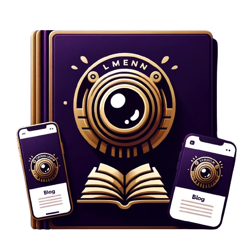
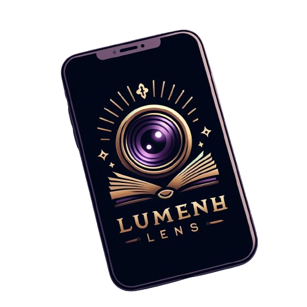

<h1 align="center">LumenLens | Backend for Blog Application</h1>
<div style="display: flex; justify-content: center;">

<div align="center">
    <a href="lumenlense1.png"></a>
    <a href="lumenlens2.png"></a>
</div>

LumenLens is a powerful backend solution tailored for a blog application, offering secure authentication, CRUD operations, and additional features to enhance the user experience. Built using Lumen, a lightweight PHP framework, it provides efficient endpoints for seamless communication between the frontend and server.


## Responsibilities
During my involvement with LumenLens, I had the following responsibilities:
- Designed and implemented RESTful APIs to enable smooth communication between the frontend and the server.
- Leveraged Lumen, a PHP micro-framework, to develop a robust and scalable backend, ensuring optimal performance for the blog application.
- Implemented secure user authentication and authorization mechanisms to safeguard user data and ensure privacy.
- Developed and maintained a MySQL database for efficient storage and management of blog posts, user data, and application-related information.
- Integrated Postman collections for easy API testing and documentation, ensuring reliability and ease of use.
- Collaborated closely with frontend developers to ensure seamless integration and compatibility.
- Implemented comprehensive testing using PHPUnit to validate individual components and ensure the reliability of the backend system.
- Set up server watching through nodemon to automatically refresh during development.
- Created migrations for database management.
- Developed a comment model and post model, allowing users to comment on posts.
- Enabled soft delete for posts and hard delete for comments.
- Applied a global guard to all routes to verify user authentication.

## Project Technologies & Tools
The project utilized the following technologies and tools:
- Lumen (PHP Micro-framework)
- MySQL
- Postman
- PHPUnit
- Git
- Nodemon

### To Run the Application
To run the LumenLens backend, follow these steps:
1. Clone the repository to your local machine.
2. Install dependencies using Composer:
   ```bash
   $ composer install
   ```
3. Set up your MySQL database and configure the database connection in the `.env` file.
4. Run the migration to set up the database schema:
   ```bash
   $ php artisan migrate
   ```
5. Start the development server using Nodemon:
   ```bash
   $ nodemon
   ```

Feel free to explore the code, documentation, and the features developed during the LumenLens project. If you have any questions or would like to collaborate, please don't hesitate to get in touch.

Happy exploring!

## Stay in touch

- **Portfolio:** [](https://github.com/nayefserag)
- **LinkedIn:** [](https://www.linkedin.com/in/nayf-serag-70a3611b8)
